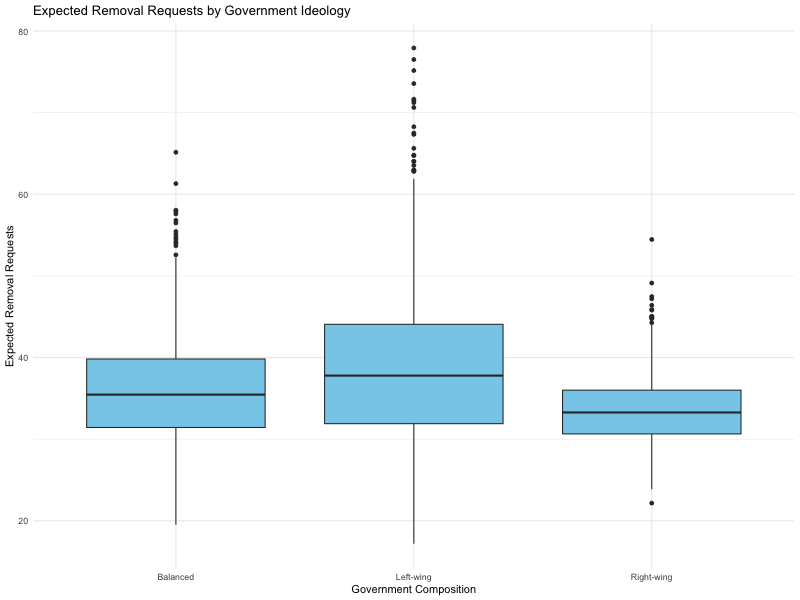
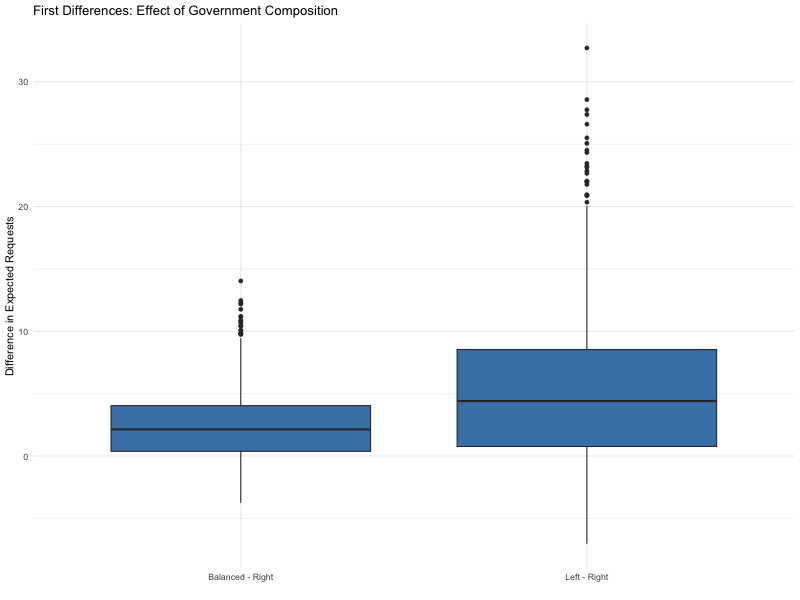
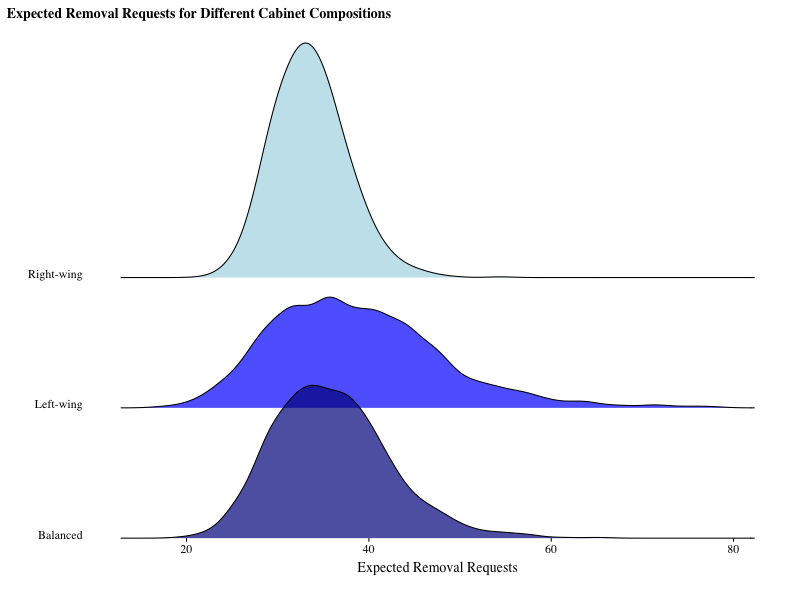

# government-censorship-analysis
A data-driven exploration of government ideology and online censorship in Western democracies(2011–2020).

## 📄 Project Description

This repository contains my original data analysis and modeling work for a collaborative academic project examining how government ideology affects content removal requests in democratic countries.

The literature review and introductory sections of the final paper were authored by my collaborator and are **not included here**, out of respect for their intellectual contribution.

All R code, statistical models, and visualizations in this repository were developed by me using data from Google Transparency Reports, OECD datasets, and the Global Terrorism Index.

## 📂 Project Structure

- `analysis_cleaned.Rmd` – main modeling and regression analysis
- `visual_summary.Rmd` – scenario simulation and visualization
- `visual_summary.html` – rendered version (viewable without running code)
- `models/m6_model.RData` – pre-fitted model used in visualizations
- `figures/` – exported plots (PNG format) for portfolio use
- `data/README.md` – explains why the raw data is not included

## 📊 Key Visualizations

### Expected Values by Ideology

### First Differences (95% Confidence Intervals)

### Distribution by Government Type (Ridge Plot)

## 🔐 Note on Data Access

The dataset used in this project is not publicly available in the repository to respect privacy constraints.  
However, the rendered HTML and exported plots allow full review of results.

If you're interested in reproducing the analysis, feel free to reach out for guidance on data structure and variables.
